# NaughtyAttributes

NaughtyAttributes expands the range of attributes that the Unity Inspector provides so that you can create powerful inspectors without the need of custom editors or property drawers. It also provides attributes that can be applied to non-serialized fields or functions.

Most of the attributes are implemented using Unity's `CustomPropertyDrawer`, so they will work in your custom editors.
The attributes that won't work in your custom editors are the meta attributes and some drawer attributes such as
`ReorderableList`, `Button`, `ShowNonSerializedField` and `ShowNativeProperty`.
If you want all of the attributes to work in your custom editors, however, you must inherit from `NaughtyInspector` and use the `NaughtyEditorGUI.PropertyField_Layout` function instead of `EditorGUILayout.PropertyField`.

## System Requirements
Unity **2019.4** or later versions. Don't forget to include the NaughtyAttributes namespace.

## Installation
1. Clone this repo directly into your Packages folder.

2. The package is available on the [openupm registry](https://openupm.com). You can install it via [openupm-cli](https://github.com/openupm/openupm-cli).
```
openupm add com.dbrizov.naughtyattributes
```
3. You can also install via git url by adding this entry in your **manifest.json**
```
"com.dbrizov.naughtyattributes": "https://github.com/dbrizov/NaughtyAttributes.git#upm"
```
4. You can also download it from the [Asset Store](https://assetstore.unity.com/packages/tools/utilities/naughtyattributes-129996)


# Overview

Some more docs that should be merged into this readme: https://dbrizov.github.io/na-docs/attributes/drawer_attributes/index.html

## Special Attributes

### AllowNesting
This attribute must be used in some cases when you want meta attributes to work inside serializable nested structs or classes.

```csharp
public class NaughtyComponent : MonoBehaviour
{
    public MyStruct myStruct;
}

[System.Serializable]
public struct MyStruct
{
    public bool enableFlag;

    [EnableIf("enableFlag")]
    [AllowNesting] // Because it's nested we need to explicitly allow nesting
    public int integer;
}
```

>Note
>>    The ``AllowNesting`` attribute is actually a drawer attribute. You can think of it as a ``DefaultDrawer`` attribute.
    All it does is draw the serialized field with its default drawer. This is a bit of a hack you see.
    The system is implemented in such a way that before a drawer's ``OnGUI`` function is called it applies the **meta** and **validator** attributes.
    In order to trigger this behavoir we need some kind of a drawer. The ``AllowNesting`` is that drawer.
    If for you are combining :ref:`label-enable-disable-if` with :ref:`label-min-max-slider` for instance,
    you don't have to put the ``AllowNesting`` attribute, because you already marked the serialized field with the ``MinMaxSlider`` drawer.


## Drawer Attributes
Provide special draw options to serialized fields.
A field can have only one DrawerAttribute. If a field has more than one, only the bottom one will be used.

### AnimatorParam
Select an Animator paramater via dropdown interface.

```csharp
public class NaughtyComponent : MonoBehaviour
{
	public Animator someAnimator;

	[AnimatorParam("someAnimator")]
	public int paramHash;

	[AnimatorParam("someAnimator")]
	public string paramName;
}
```

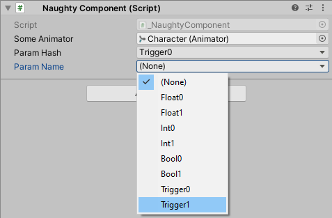

### Button
A method can be marked as a button. A button appears in the inspector and executes the method if clicked.
Works both with instance and static methods.

```csharp
public class NaughtyComponent : MonoBehaviour
{
	[Button]
	private void MethodOne() { }

	[Button("Button Text")]
	private void MethodTwo() { }
}
```

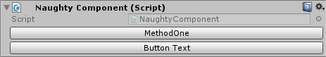

### CurveRange
Set bounds and modify curve color for AnimationCurves

```csharp
public class NaughtyComponent : MonoBehaviour
{
	[CurveRange(-1, -1, 1, 1)]
	public AnimationCurve curve;

	[CurveRange(EColor.Orange)]
	public AnimationCurve curve1;

	[CurveRange(0, 0, 5, 5, EColor.Red)]
	public AnimationCurve curve2;
}
```

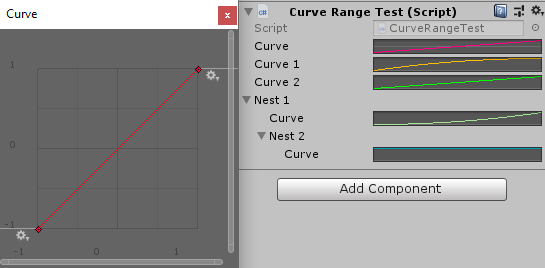

### Dropdown
Provides an interface for dropdown value selection.

```csharp
public class NaughtyComponent : MonoBehaviour
{
	[Dropdown("intValues")]
	public int intValue;

	[Dropdown("StringValues")]
	public string stringValue;

	[Dropdown("GetVectorValues")]
	public Vector3 vectorValue;

	private int[] intValues = new int[] { 1, 2, 3, 4, 5 };

	private List<string> StringValues { get { return new List<string>() { "A", "B", "C", "D", "E" }; } }

	private DropdownList<Vector3> GetVectorValues()
	{
		return new DropdownList<Vector3>()
		{
			{ "Right",   Vector3.right },
			{ "Left",    Vector3.left },
			{ "Up",      Vector3.up },
			{ "Down",    Vector3.down },
			{ "Forward", Vector3.forward },
			{ "Back",    Vector3.back }
		};
	}
}
```

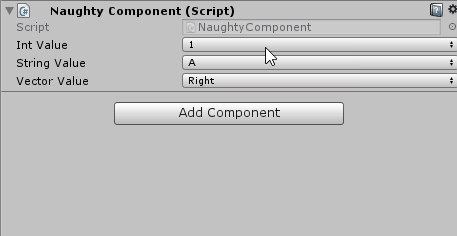

### EnumFlags
Provides dropdown interface for setting enum flags.

```csharp
public enum Direction
{
	None = 0,
	Right = 1 << 0,
	Left = 1 << 1,
	Up = 1 << 2,
	Down = 1 << 3
}

public class NaughtyComponent : MonoBehaviour
{
	[EnumFlags]
	public Direction flags;
}
```

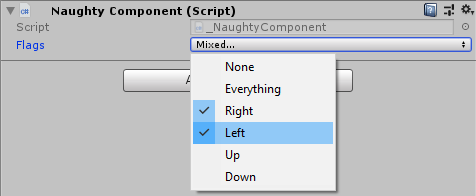

### Expandable
Make scriptable objects expandable.

```csharp
public class NaughtyComponent : MonoBehaviour
{
	[Expandable]
	public ScriptableObject scriptableObject;
}
```

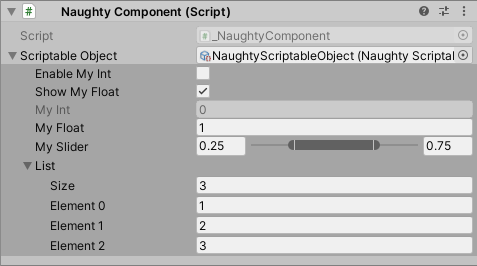

### HorizontalLine

```csharp
public class NaughtyComponent : MonoBehaviour
{
	[HorizontalLine(color: EColor.Red)]
	public int red;

	[HorizontalLine(color: EColor.Green)]
	public int green;

	[HorizontalLine(color: EColor.Blue)]
	public int blue;
}
```

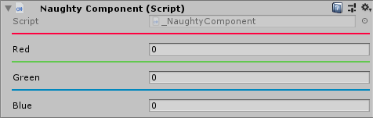

### InfoBox
Used for providing additional information.

```csharp
public class NaughtyComponent : MonoBehaviour
{
	[InfoBox("This is my int", EInfoBoxType.Normal)]
	public int myInt;

	[InfoBox("This is my float", EInfoBoxType.Warning)]
	public float myFloat;

	[InfoBox("This is my vector", EInfoBoxType.Error)]
	public Vector3 myVector;
}
```

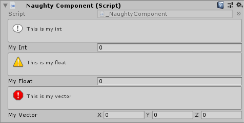

### InputAxis
Select an input axis via dropdown interface.

```csharp
public class NaughtyComponent : MonoBehaviour
{
	[InputAxis]
	public string inputAxis;
}
```

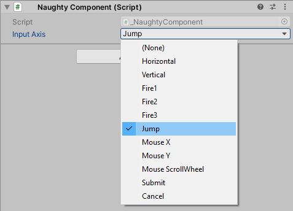

### Layer
Select a layer via dropdown interface.

```csharp
public class NaughtyComponent : MonoBehaviour
{
	[Layer]
	public string layerName;

	[Layer]
	public int layerIndex;
}
```

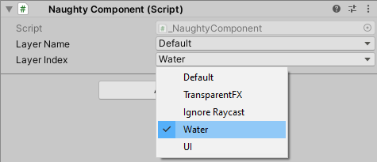

### MinMaxSlider
A double slider. The **min value** is saved to the **X** property, and the **max value** is saved to the **Y** property of a **Vector2** field.

```csharp
public class NaughtyComponent : MonoBehaviour
{
	[MinMaxSlider(0.0f, 100.0f)]
	public Vector2 minMaxSlider;
}
```

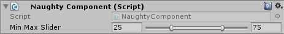

### ProgressBar
```csharp
public class NaughtyComponent : MonoBehaviour
{
	[ProgressBar("Health", 300, EColor.Red)]
	public int health = 250;

	[ProgressBar("Mana", 100, EColor.Blue)]
	public int mana = 25;

	[ProgressBar("Stamina", 200, EColor.Green)]
	public int stamina = 150;
}
```

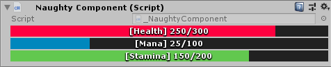

### ReorderableList
Provides array type fields with an interface for easy reordering of elements.

```csharp
public class NaughtyComponent : MonoBehaviour
{
	[ReorderableList]
	public int[] intArray;

	[ReorderableList]
	public List<float> floatArray;
}
```

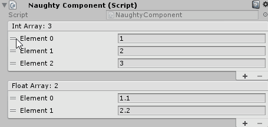

### ResizableTextArea
A resizable text area where you can see the whole text.
Unlike Unity's **Multiline** and **TextArea** attributes where you can see only 3 rows of a given text, and in order to see it or modify it you have to manually scroll down to the desired row.

```csharp
public class NaughtyComponent : MonoBehaviour
{
	[ResizableTextArea]
	public string resizableTextArea;
}
```

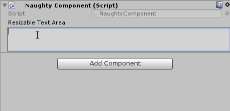

### Scene
Select a scene from the build settings via dropdown interface.

```csharp
public class NaughtyComponent : MonoBehaviour
{
	[Scene]
	public string bootScene; // scene name

	[Scene]
	public int tutorialScene; // scene index
}
```

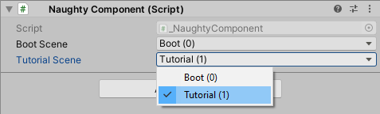

### ShowAssetPreview
Shows the texture preview of a given asset (Sprite, Prefab...).

```csharp
public class NaughtyComponent : MonoBehaviour
{
	[ShowAssetPreview]
	public Sprite sprite;

	[ShowAssetPreview(128, 128)]
	public GameObject prefab;
}
```

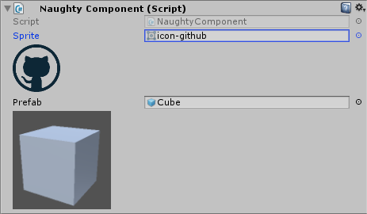

### ShowNativeProperty
Shows native C# properties in the inspector.
All native properties are displayed at the bottom of the inspector after the non-serialized fields and before the method buttons.
It supports only certain types **(bool, int, long, float, double, string, Vector2, Vector3, Vector4, Color, Bounds, Rect, UnityEngine.Object)**.

```csharp
public class NaughtyComponent : MonoBehaviour
{
	public List<Transform> transforms;

	[ShowNativeProperty]
	public int TransformsCount => transforms.Count;
}
```

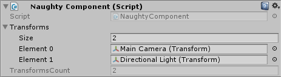

### ShowNonSerializedField
Shows non-serialized fields in the inspector.
All non-serialized fields are displayed at the bottom of the inspector before the method buttons.
Keep in mind that if you change a non-static non-serialized field in the code - the value in the inspector will be updated after you press **Play** in the editor.
There is no such issue with static non-serialized fields because their values are updated at compile time.
It supports only certain types **(bool, int, long, float, double, string, Vector2, Vector3, Vector4, Color, Bounds, Rect, UnityEngine.Object)**.

```csharp
public class NaughtyComponent : MonoBehaviour
{
	[ShowNonSerializedField]
	private int myInt = 10;

	[ShowNonSerializedField]
	private const float PI = 3.14159f;

	[ShowNonSerializedField]
	private static readonly Vector3 CONST_VECTOR = Vector3.one;
}
```

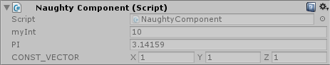

### SortingLayer
Select a sorting layer via dropdown interface.

```csharp
public class NaughtyComponent : MonoBehaviour
{
	[SortingLayer]
	public string layerName;

	[SortingLayer]
	public int layerId;
}
```

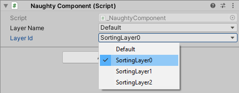

### Tag
Select a tag via dropdown interface.

```csharp
public class NaughtyComponent : MonoBehaviour
{
	[Tag]
	public string tagField;
}
```

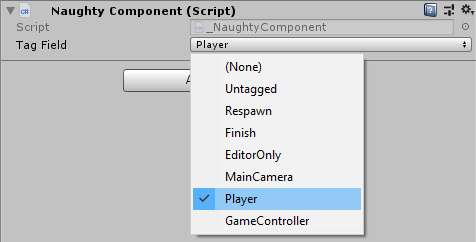

## Meta Attributes
Give the fields meta data. A field can have more than one meta attributes.

### BoxGroup
Surrounds grouped fields with a box.

```csharp
public class NaughtyComponent : MonoBehaviour
{
	[BoxGroup("Integers")]
	public int firstInt;
	[BoxGroup("Integers")]
	public int secondInt;

	[BoxGroup("Floats")]
	public float firstFloat;
	[BoxGroup("Floats")]
	public float secondFloat;
}
```

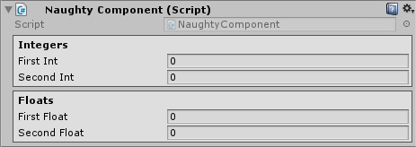

### Foldout
Makes a foldout group.

```csharp
public class NaughtyComponent : MonoBehaviour
{
	[Foldout("Integers")]
	public int firstInt;
	[Foldout("Integers")]
	public int secondInt;
}
```

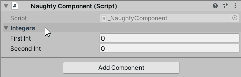

### EnableIf / DisableIf
```csharp
public class NaughtyComponent : MonoBehaviour
{
	public bool enableMyInt;

	[EnableIf("enableMyInt")]
	public int myInt;

	[EnableIf("Enabled")]
	public float myFloat;

	[EnableIf("NotEnabled")]
	public Vector3 myVector;

	public bool Enabled() { return true; }

	public bool NotEnabled => false;
}
```

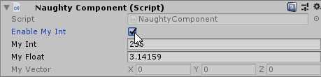

You can have more than one condition.

```csharp
public class NaughtyComponent : MonoBehaviour
{
	public bool flag0;
	public bool flag1;

	[EnableIf(EConditionOperator.And, "flag0", "flag1")]
	public int enabledIfAll;

	[EnableIf(EConditionOperator.Or, "flag0", "flag1")]
	public int enabledIfAny;
}
```

### ShowIf / HideIf
```csharp
public class NaughtyComponent : MonoBehaviour
{
	public bool showInt;

	[ShowIf("showInt")]
	public int myInt;

	[ShowIf("AlwaysShow")]
	public float myFloat;

	[ShowIf("NeverShow")]
	public Vector3 myVector;

	public bool AlwaysShow() { return true; }

	public bool NeverShow => false;
}
```

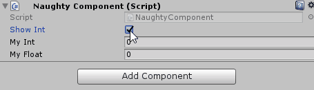

You can have more than one condition.

```csharp
public class NaughtyComponent : MonoBehaviour
{
	public bool flag0;
	public bool flag1;

	[ShowIf(EConditionOperator.And, "flag0", "flag1")]
	public int showIfAll;

	[ShowIf(EConditionOperator.Or, "flag0", "flag1")]
	public int showIfAny;
}
```

### Label
Override default field label.

```csharp
public class NaughtyComponent : MonoBehaviour
{
	[Label("Short Name")]
	public string veryVeryLongName;

	[Label("RGB")]
	public Vector3 vectorXYZ;
}
```

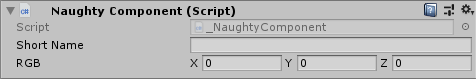

### OnValueChanged
Detects a value change and executes a callback.
Keep in mind that the event is detected only when the value is changed from the inspector.
If you want a runtime event, you should probably use an event/delegate and subscribe to it.

```csharp
public class NaughtyComponent : MonoBehaviour
{
	[OnValueChanged("OnValueChangedCallback")]
	public int myInt;

	private void OnValueChangedCallback()
	{
		Debug.Log(myInt);
	}
}
```

### ReadOnly
Make a field read only.

```csharp
public class NaughtyComponent : MonoBehaviour
{
	[ReadOnly]
	public Vector3 forwardVector = Vector3.forward;
}
```

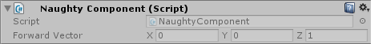

## Validator Attributes
Used for validating the fields. A field can have infinite number of validator attributes.

### MinValue / MaxValue
Clamps integer and float fields.

```csharp
public class NaughtyComponent : MonoBehaviour
{
	[MinValue(0), MaxValue(10)]
	public int myInt;

	[MinValue(0.0f)]
	public float myFloat;
}
```

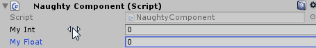

### Required
Used to remind the developer that a given reference type field is required.

```csharp
public class NaughtyComponent : MonoBehaviour
{
	[Required]
	public Transform myTransform;

	[Required("Custom required text")]
	public GameObject myGameObject;
}
```

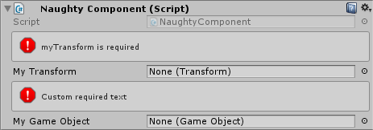

### ValidateInput
The most powerful ValidatorAttribute.

```csharp
public class _NaughtyComponent : MonoBehaviour
{
	[ValidateInput("IsNotNull")]
	public Transform myTransform;

	[ValidateInput("IsGreaterThanZero", "myInteger must be greater than zero")]
	public int myInt;

	private bool IsNotNull(Transform tr)
	{
		return tr != null;
	}

	private bool IsGreaterThanZero(int value)
	{
		return value > 0;
	}
}
```

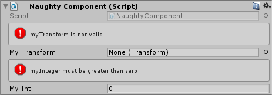
